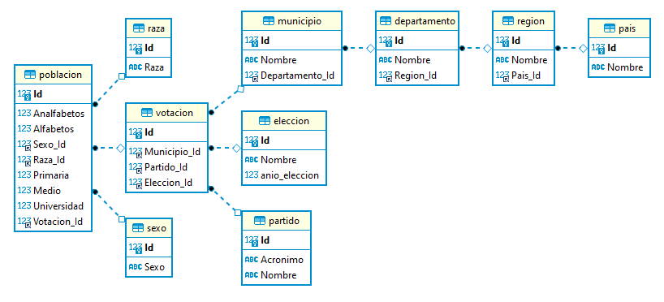

# Proyecto 2
| Carnet | Nombre |
| ------ | -------  |
| 201801229 |Osman Alejandro Perez Lopez|

En el siguiente proyecto se solicito que se desarrollara un modelo de una base de datos relacional para cubrir la necesidad de tener un sistema escalable y lo más optimo posible. 
El Instituto Centroamericano electoral (ICE) solicito ayuda para realizar reingeniería al proceso de almacenamiento debido a que actualmente
hay demasiada inconsistencia que puede provocarles serios problemas legales.

# Alcance
El modelo sera optimizado por medio de las reglas de normalización (1FN, 2FN Y 3FN) presentadad y explicadas más adelante, esto con el objetivo de mejorar la eficiencia en tiempo de respuesta al realizar consultas de la información almacenada y que la información devuelta sea la correcta.

# Normalización

## 1era. Forma Normal (1FN)

Buscaremos que cada columna solo tenga un valor atomico. Por esto separaremos varias columans de la siguiente manera.

### Tabla Completa
 | NOMBRE_ELECCION | AÑO_ELECCION | PAIS | 	REGION | DEPTO | MUNICIPIO | PARTIDO | 	NOMBRE_PARTIDO | 	SEXO | RAZA | ANALFABETOS  | ALFABETOS | SEXO | 	RAZA | PRIMARIA	 | NIVEL MEDIO | UNIVERSITARIOS | 
 | ------ | -------  |------ | -------  |------ | -------  |------ | -------  |------ | -------  |------ | -------  |------ | -------  |------ | -------  |------ |
|Elecciones Municipales|	2005|	EL SALVADOR	|REGION 1|	Cabañas  | 	Sensuntepeque	|ARENA	|Alianza Nac. Rep.	|hombres	|INDIGENAS|	2298|	4800|	hombres	|INDIGENAS|	1471|	450|	2879|
|Elecciones Municipales|	2005|	EL SALVADOR|	REGION 1|	Cabañas|   	Ilobasco|	ARENA|	Alianza Nac. Rep.|	hombres|	INDIGENAS|	2448|	5536|	hombres	|INDIGENAS|	1807|	2966|	763|
|Elecciones Municipales|	2005|	EL SALVADOR|	REGION 1|	Cabañas|   	Victoria|	ARENA|	Alianza Nac. Rep.|	hombres|	INDIGENAS|	1724|	3638|	hombres	|INDIGENAS|	1421|	1183|	1034|
|Elecciones Municipales|	2005|	EL SALVADOR|	REGION 1|	Cabañas|   	San Isidro|	ARENA|	Alianza Nac. Rep.|	hombres|	INDIGENAS|	583|	2772|	hombres	|INDIGENAS|	1747	|895|	130|
|Elecciones Municipales|	2005|	EL SALVADOR|	REGION 1|	Cabañas|   	Jutiapa|	ARENA|	Alianza Nac. Rep.|	hombres|	INDIGENAS|	31|	5010|	hombres	|INDIGENAS|	2576|	602|	1832|
|Elecciones Municipales|	2005|	EL SALVADOR|	REGION 1|	Cabañas|   	Tejutepeque|	ARENA|	Alianza Nac. Rep.|	hombres|	INDIGENAS|	883|	5972|	hombres|	INDIGENAS|	2129|	2947|	896|
|Elecciones Municipales|	2005|	EL SALVADOR|	REGION 1|	Cabañas|   	Dolores|	ARENA|	Alianza Nac. Rep.|	hombres|	INDIGENAS|	1160|	4563|	hombres	|INDIGENAS|	139	|1879|	2545|
|Elecciones Municipales|	2005|	EL SALVADOR|	REGION 1|	Cabañas|   	Cinquera|	ARENA|	Alianza Nac. Rep.|	hombres|	INDIGENAS|	689|	3472|	hombres	|INDIGENAS|	275	|263	|2934|
|Elecciones Municipales|	2005|	EL SALVADOR|	REGION 1|	Cabañas|   	Guacotecti|	ARENA|	Alianza Nac. Rep.|	hombres|	INDIGENAS|	49|	3094|	hombres	|INDIGENAS|	678	|1521|	895|

Se crearon las siguientes tablas.

### Tabla Pais
|Id|Nombre     |
|--|-----------|
|1|Costa Rica |
|2|EL SALVADOR|
|3|GUATEMALA  |
|4|HONDURAS   |
|5|Nicaragua  |
|6|Panama     |

### Tabla Region
|Id|Nombre  |Pais_Id|
|--|--------|-------|
| 1|REGION 1|      1|
| 2|REGION 1|      2|
| 3|Región 1|      3|
| 4|REGION 1|      4|
| 5|REGION 1|      5|
| 6|REGION 1|      6|
| 7|REGION 2|      1|
| 8|REGION 2|      2|
| 9|Región 2|      3|
|10|REGION 2|      4|
|11|REGION 2|      5|

### Tabla Departamento
|Id|Nombre              |Region_Id|
|--|--------------------|---------|
| 1|Cabañas             |        2|
| 2|Chalatenango        |        8|
| 3|Cuscatlán           |       13|
| 4|La Libertad         |       13|
| 5|La Paz              |       13|
| 6|La Unión            |       16|
| 7|Morazán             |       16|
| 8|San Miguel          |       16|
| 9|San Salvador        |       13|
|10|Santa Ana           |        8|
|11|San Vicente         |        8|

### Tabla Municipio
|Id |Nombre                      |Departamento_Id|
|---|----------------------------|---------------|
|  1|Abangares                   |             33|
|  2|Acajutla                    |             12|
|  3|Acatenango                  |             63|
|  4|Achuapa                     |             21|
|  5|Acoyapa                     |             17|
|  6|Agua Blanca                 |             81|
|  7|Agua Caliente               |              2|
|  8|Aguacatán                   |             72|
|  9|Aguantequerique             |             48|
| 10|Aguilares                   |              9|
| 11|Aguirre                     |             36|

### Tabla Eleccion
|Id|Nombre|Anio_Eleccion|
|------|------ | -------  |
|1|Elecciones Municipales|	2001|
|2|Elecciones Municipales|	2005|

### Tabla Partido
|Id|Partido|Nombre                     |
|--|-------|---------------------------|
| 1|ARENA  |Alianza Nac. Rep.          |
| 2|DCH    |Democracia Cristiana Hon.  |
| 3|FMLN   |Farabundo Marti lib. Nac.  |
| 4|FSLN   |Fr. Sandinista de Lib. Nac.|
| 5|PAN    |Partido Accion Nacional    |
| 6|PC     |Partido Civil              |
| 7|PCD    |Partido Const. Dem.        |
| 8|PDG    |Partido Democratico Guat.  |
| 9|PDN    |Partido Democratico de N.. |
|10|PDP    |Partido Democratico Pan.   |
|11|PHT    |Partido Hondureño del trab.|

### Tabla Poblacion
Id |Analfabetos|Alfabetos|Sexo|Raza|Primaria|Medio|Universidad|Municipio_Id|Partido_Id|Eleccion_Id|
---|-----------|---------|-------|-------|--------|-----|-----------|------------|----------|-----------|
  1|          1|     3130|      hombres|INDIGENAS|    2275|    5|        850|               1051|        17|          1|
  2|          1|     4127|      mujeres|INDIGENAS|    1148| 1544|       1435|                229|         2|          1|
  3|          1|     4883|      mujeres|INDIGENAS|     791| 1137|       2955|                412|         8|          2|
  4|          1|     6266|      hombres|INDIGENAS|    2727|  717|       2822|               688|        11|          1|

## 2da. Forma Normal (2FN)
Cada registro debe depender de la clave primaria de la tabla a la que perteneces.
Por esa razon se separa de la tabla poblacion las tablas, sexo y raza.

### Tabla Sexo
|Id|Sexo|
|------|------ | 
|1|hombres|
|2|mujeres|

### Tabla Raza
|Id|Raza|
|------|------ | 
|1|GARIFUNAS|
|2|INDIGENAS|
|3|LADINOS|

### Tabla Pais
|Id|Nombre     |
|--|-----------|
|1|Costa Rica |
|2|EL SALVADOR|
|3|GUATEMALA  |
|4|HONDURAS   |
|5|Nicaragua  |
|6|Panama     |

### Tabla Region
|Id|Nombre  |Pais_Id|
|--|--------|-------|
| 1|REGION 1|      1|
| 2|REGION 1|      2|
| 3|Región 1|      3|
| 4|REGION 1|      4|
| 5|REGION 1|      5|
| 6|REGION 1|      6|
| 7|REGION 2|      1|
| 8|REGION 2|      2|
| 9|Región 2|      3|
|10|REGION 2|      4|
|11|REGION 2|      5|

### Tabla Departamento
|Id|Nombre              |Region_Id|
|--|--------------------|---------|
| 1|Cabañas             |        2|
| 2|Chalatenango        |        8|
| 3|Cuscatlán           |       13|
| 4|La Libertad         |       13|
| 5|La Paz              |       13|
| 6|La Unión            |       16|
| 7|Morazán             |       16|
| 8|San Miguel          |       16|
| 9|San Salvador        |       13|
|10|Santa Ana           |        8|
|11|San Vicente         |        8|

### Tabla Municipio
|Id |Nombre                      |Departamento_Id|
|---|----------------------------|---------------|
|  1|Abangares                   |             33|
|  2|Acajutla                    |             12|
|  3|Acatenango                  |             63|
|  4|Achuapa                     |             21|
|  5|Acoyapa                     |             17|
|  6|Agua Blanca                 |             81|
|  7|Agua Caliente               |              2|
|  8|Aguacatán                   |             72|
|  9|Aguantequerique             |             48|
| 10|Aguilares                   |              9|
| 11|Aguirre                     |             36|

### Tabla Eleccion
|Id|Nombre|Anio_Eleccion|
|------|------ | -------  |
|1|Elecciones Municipales|	2001|
|2|Elecciones Municipales|	2005|

### Tabla Partido
|Id|Partido|Nombre                     |
|--|-------|---------------------------|
| 1|ARENA  |Alianza Nac. Rep.          |
| 2|DCH    |Democracia Cristiana Hon.  |
| 3|FMLN   |Farabundo Marti lib. Nac.  |
| 4|FSLN   |Fr. Sandinista de Lib. Nac.|
| 5|PAN    |Partido Accion Nacional    |
| 6|PC     |Partido Civil              |
| 7|PCD    |Partido Const. Dem.        |
| 8|PDG    |Partido Democratico Guat.  |
| 9|PDN    |Partido Democratico de N.. |
|10|PDP    |Partido Democratico Pan.   |
|11|PHT    |Partido Hondureño del trab.|

### Tabla Poblacion
Id |Analfabetos|Alfabetos|Sexo|Raza|Primaria|Medio|Universidad|Municipio_Id|Partido_Id|Eleccion_Id|
---|-----------|---------|-------|-------|--------|-----|-----------|------------|----------|-----------|
  1|          1|     3130|      1|2|    2275|    5|        850|               1051|        17|          1|
  2|          1|     4127|      2|2|    1148| 1544|       1435|                229|         2|          1|
  3|          1|     4883|      2|2|     791| 1137|       2955|                412|         8|          2|
  4|          1|     6266|      1|2|    2727|  717|       2822|  

## 3ra. Forma Normal (3FN)
Cada campo debe de representar un hecho acerca de la llave primaria y nada más.
Por esa razon creamos la tabla votacion que unira el municipio, la eleccion y el partido, y la tabla poblacion se relacionara con la votacion.

### Tabla Sexo
|Id|Sexo|
|------|------ | 
|1|hombres|
|2|mujeres|

### Tabla Raza
|Id|Raza|
|------|------ | 
|1|GARIFUNAS|
|2|INDIGENAS|
|3|LADINOS|

### Tabla Pais
|Id|Nombre     |
|--|-----------|
|1|Costa Rica |
|2|EL SALVADOR|
|3|GUATEMALA  |
|4|HONDURAS   |
|5|Nicaragua  |
|6|Panama     |

### Tabla Region
|Id|Nombre  |Pais_Id|
|--|--------|-------|
| 1|REGION 1|      1|
| 2|REGION 1|      2|
| 3|Región 1|      3|
| 4|REGION 1|      4|
| 5|REGION 1|      5|
| 6|REGION 1|      6|
| 7|REGION 2|      1|
| 8|REGION 2|      2|
| 9|Región 2|      3|
|10|REGION 2|      4|
|11|REGION 2|      5|

### Tabla Departamento
|Id|Nombre              |Region_Id|
|--|--------------------|---------|
| 1|Cabañas             |        2|
| 2|Chalatenango        |        8|
| 3|Cuscatlán           |       13|
| 4|La Libertad         |       13|
| 5|La Paz              |       13|
| 6|La Unión            |       16|
| 7|Morazán             |       16|
| 8|San Miguel          |       16|
| 9|San Salvador        |       13|
|10|Santa Ana           |        8|
|11|San Vicente         |        8|

### Tabla Municipio
|Id |Nombre                      |Departamento_Id|
|---|----------------------------|---------------|
|  1|Abangares                   |             33|
|  2|Acajutla                    |             12|
|  3|Acatenango                  |             63|
|  4|Achuapa                     |             21|
|  5|Acoyapa                     |             17|
|  6|Agua Blanca                 |             81|
|  7|Agua Caliente               |              2|
|  8|Aguacatán                   |             72|
|  9|Aguantequerique             |             48|
| 10|Aguilares                   |              9|
| 11|Aguirre                     |             36|

### Tabla Eleccion
|Id|Nombre|Anio_Eleccion|
|------|------ | -------  |
|1|Elecciones Municipales|	2001|
|2|Elecciones Municipales|	2005|

### Tabla Partido
|Id|Partido|Nombre                     |
|--|-------|---------------------------|
| 1|ARENA  |Alianza Nac. Rep.          |
| 2|DCH    |Democracia Cristiana Hon.  |
| 3|FMLN   |Farabundo Marti lib. Nac.  |
| 4|FSLN   |Fr. Sandinista de Lib. Nac.|
| 5|PAN    |Partido Accion Nacional    |
| 6|PC     |Partido Civil              |
| 7|PCD    |Partido Const. Dem.        |
| 8|PDG    |Partido Democratico Guat.  |
| 9|PDN    |Partido Democratico de N.. |
|10|PDP    |Partido Democratico Pan.   |
|11|PHT    |Partido Hondureño del trab.|

### Tabla Votacion
|Id  |Municipio_Id|Partido_Id|Eleccion_Id|
|----|------------|----------|-----------|
|3141|        1051|        17|          1|
| 682|         229|         2|          1|
|1228|         412|         8|          2|
|2055|         688|        11|          1|

### Tabla Poblacion
Id |Analfabetos|Alfabetos|Sexo_Id|Raza_Id|Primaria|Medio|Universidad|Votacion_Id|
---|-----------|---------|-------|-------|--------|-----|-----------|-----------|
  1|          1|     3130|      1|      2|    2275|    5|        850|       3141|
  2|          1|     4127|      2|      2|    1148| 1544|       1435|        682|
  3|          1|     4883|      2|      2|     791| 1137|       2955|       1228|
  4|          1|     6266|      1|      2|    2727|  717|       2822|       2055|

## Modelo Entidad Relacion

